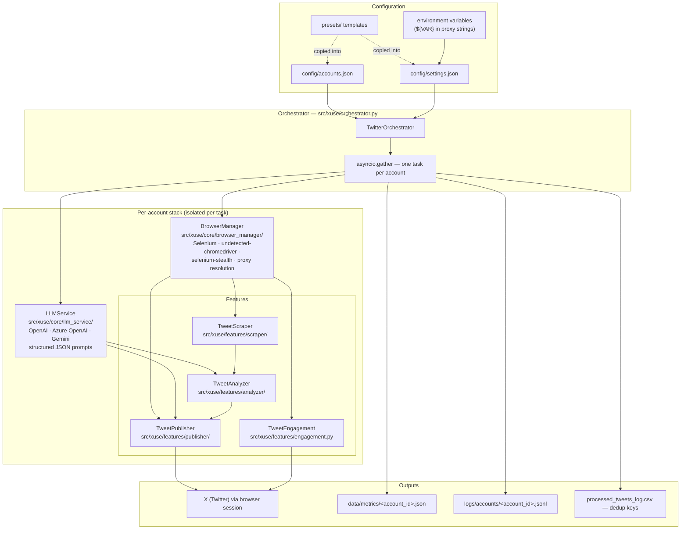
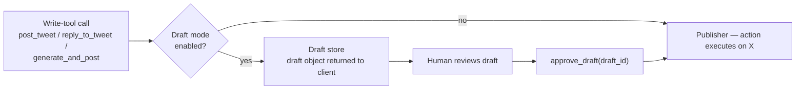

# Architecture

This document describes the architecture of **x-use** (formerly `twitter-automation-ai`): browser-native AI agents for X (Twitter) — multi-account, MCP-ready, no API keys required.

Sections 1–5 describe the engine as it exists today, packaged under `src/xuse/` since v2.0. Section 6 describes the v2.0 packaging, CLI, and MCP layer, which shipped with the rebrand; section 6.3 covers what is still planned.

## 1. Overview

x-use is a Python 3.9+ framework that automates X accounts through a real browser instead of the paid X API. It scrapes timelines and search results, uses LLMs to decide what is worth engaging with, generates content, and performs actions (post, reply, retweet, quote, like) through Selenium — all driven by JSON configuration.

Four principles shape the design:

- **Browser-native.** All reads and writes go through a real Chrome or Firefox session authenticated with the account's own cookies. There is no dependency on the X API, its pricing tiers, or its write quotas.
- **Config-driven.** Behavior is declared in `config/settings.json` (global defaults) and `config/accounts.json` (per-account overrides). Ready-made templates live in `presets/`. Code changes are never required to change what an account does.
- **Per-account isolation.** Every account gets its own browser instance, cookie jar, optional proxy, LLM preferences, action budget, and metrics files. Accounts run as independent asyncio tasks; one account crashing does not take down the others.
- **LLM-augmented pipelines.** LLMs (OpenAI, Azure OpenAI, Gemini) are used as gates and generators inside deterministic pipelines: relevance scoring, sentiment classification, thread detection, and text generation. Heuristic fallbacks keep pipelines functional when an LLM call fails.

## 2. System Diagram



`ConfigLoader` (`src/xuse/core/config_loader.py`) merges settings and account definitions; the orchestrator instantiates one full stack — browser, LLM service, feature modules, metrics recorder — per active account and runs them concurrently with `asyncio.gather(*tasks, return_exceptions=True)`.

## 3. Module Map

| Path | Responsibility |
|---|---|
| `src/xuse/orchestrator.py` | `TwitterOrchestrator`: loads config, spawns one asyncio task per account, runs the action pipelines, owns dedup keys and per-account cleanup. The legacy `python src/main.py` entry is a deprecation shim that runs this module. |
| `src/xuse/cli.py`, `init_wizard.py`, `doctor.py` | Typer console script `x-use`: `run` (orchestrator with in-memory account/pipeline scoping), `init` (setup wizard), `doctor` (preflight checks), `mcp` (server entry). |
| `src/xuse/mcp/` | MCP stdio server: `server.py` (FastMCP factory), `tools.py` / `write_tools.py` / `engage.py` (the 9 tools), `drafts.py` (draft store), `sessions.py` (lazy browser pool), `executor.py` / `actions.py` (execution, pacing, sanitized error envelopes). |
| `tests/` | pytest suite (pure logic + MCP contract tests), `pytest.ini`, CI in `.github/workflows/ci.yml`. |
| `src/xuse/core/config_loader.py` | Loads and exposes `config/settings.json` and `config/accounts.json`; helper accessors like `get_twitter_automation_setting`. |
| `src/xuse/core/browser_manager/` | Browser lifecycle. `drivers.py` (Chrome/Firefox init, undetected-chromedriver, stealth), `options.py` (driver options, headless, window size), `cookies.py` (load and inject cookie files), `ua.py` (user-agent generation), `service.py` (the `BrowserManager` facade, proxy resolution, signed-in detection). |
| `src/xuse/core/llm_service/` | Provider-agnostic LLM access. `clients.py` (OpenAI/Azure/Gemini client init from config), `generator.py` (`TextGenerator` with provider preference and fallback order), `prompts.py` (schema-first structured JSON prompt builder with few-shots and hard character limits), `parsing.py` (robust JSON extraction from model output), `service.py` (the `LLMService` facade: `generate_text`, `generate_structured`). |
| `src/xuse/features/scraper/` | Read side. `service.py` (`TweetScraper`: profile, keyword-search, and arbitrary-URL/community timelines), `parsing.py` (tweet card → `ScrapedTweet`), `selectors.py` (centralized XPath/CSS selectors for X's DOM). |
| `src/xuse/features/publisher/` | Write side. `orchestrator.py` (`TweetPublisher` facade), `composer.py` (compose-and-post with media), `content_generator.py` (LLM text for posts and quotes), `reply_handler.py`, `retweet_handler.py` (retweet vs. quote), `media_manager/` (download and stage media), `audience_selector.py` (community audience picker). |
| `src/xuse/features/engagement.py` | `TweetEngagement`: likes and lightweight interactions. |
| `src/xuse/features/analyzer/` | Decision layer. `service.py` (`TweetAnalyzer`: relevance scoring, sentiment, thread detection, structured analysis), `heuristics.py` (keyword/lexicon fallbacks), `prompts.py`, `schema.py` (JSON schema for structured analysis). |
| `src/xuse/utils/` | `logger.py` (logging setup from config), `file_handler.py` (processed-action-key CSV store), `metrics.py` (`MetricsRecorder`: JSON counters + JSONL events), `login_state.py` (`wait_for_signed_in`), `proxy_manager.py` (proxy pools, hash/round-robin rotation, env interpolation), `progress.py`, `scroller.py`, `selenium_waits.py`. |
| `src/xuse/models.py` | Pydantic models: `AccountConfig`, `ActionConfig`, `LLMSettings`, `ScrapedTweet`, `TweetContent`, cookie models. |
| `config/` | `settings.json` (global), `accounts.json` (per-account array). |
| `presets/` | Copy-paste starting points: `settings/` (defaults, Chrome undetected, proxy pools hash/round-robin) and `accounts/` (growth, brand_safe, replies_first, engagement_light, community_posting). |
| `docs/CONFIG_REFERENCE.md` | Field-by-field schema for both config files. |

## 4. Anatomy of an Automation Cycle

One run of `python src/main.py` executes the following per active account (see `TwitterOrchestrator._process_account`):

1. **Config load and merge.** `ConfigLoader` reads both JSON files. Legacy override keys (`target_keywords_override`, `action_config_override`, …) are normalized onto current `AccountConfig` fields, then validated with `AccountConfig.model_validate`. Per-account values always win over `twitter_automation.action_config` global defaults.
2. **Task spawn.** `run()` creates one coroutine per account and awaits them with `asyncio.gather`. Blocking Selenium work is pushed to threads via `asyncio.to_thread`, so scraping for one account does not block the event loop for others.
3. **Login via cookies.** `BrowserManager` starts the configured browser (with resolved proxy and generated user agent), navigates to `browser_settings.cookie_domain_url`, injects cookies from `cookie_file_path` or inline `cookies`, and can wait up to `login_wait_seconds` for a signed-in state (`src/xuse/utils/login_state.py`); `BrowserManager` (`src/xuse/core/browser_manager/service.py`) also detects the logged-in handle used for own-tweet filtering.
4. **Pipelines.** Each is independently enabled by `ActionConfig` flags:
   - *Competitor reposts* — scrape configured `competitor_profiles`, filter by media/likes/retweet thresholds, then act (repost-as-rewrite, retweet, quote, or like).
   - *Community engagement* — scrape `https://x.com/i/communities/<community_id>`, then like/retweet/reply within per-run caps, skipping the account's own posts.
   - *Keyword replies* — search `target_keywords`, generate a reply under 270 characters, post it.
   - *Keyword retweets* — search `target_keywords` and retweet relevant hits.
   - *Likes* — search `like_tweets_from_keywords` (defaults to `target_keywords`) and like relevant tweets.
   - *Content curation* from `news_sites` / `research_paper_sites` is scaffolded in config and the orchestrator but not yet implemented — enabling it currently only logs that the feature is planned.
5. **Dedup check.** Every action gets a persistent key — `reply_<account_id>_<tweet_id>`, `like_<account_id>_<tweet_id>`, `community_reply_<account_id>_<tweet_id>`, etc. — checked against `FileHandler.load_processed_action_keys()` before acting. Keys are appended with timestamps to the CSV configured by `twitter_automation.processed_tweets_file` (default `processed_tweets_log.csv`); when timestamps are present, the loader scopes dedup to the current day.
6. **LLM gates.** `TweetAnalyzer` sits between scraping and acting: `score_relevance` filters candidates against configurable thresholds (`analysis_config`), `classify_sentiment` and `analyze_tweet_structured` feed the optional `engagement_decision` engine that picks quote vs. retweet vs. repost vs. like, and `check_if_thread_with_llm` confirms thread candidates before rewriting them.
7. **Action with randomized delays.** After each successful action the task sleeps `random.uniform(min_delay_between_actions_seconds, max_delay_between_actions_seconds)` (likes use half that range) to avoid mechanical timing patterns.
8. **Metrics append.** `MetricsRecorder` increments counters (posts, replies, retweets, quote_tweets, likes, errors) in `data/metrics/<account_id>.json` and appends one JSON line per action attempt — success or failure, with metadata — to `logs/accounts/<account_id>.jsonl`.
9. **Cleanup in `finally`.** The browser driver is always closed and the run-finish timestamp recorded, even when a pipeline raises. Exceptions are logged with `exc_info` and surfaced by `asyncio.gather(..., return_exceptions=True)` without aborting sibling accounts.

## 5. Reliability Mechanisms

**Rate limiting.** Three layers: randomized inter-action delays (`min`/`max_delay_between_actions_seconds`), hard per-run caps (`max_posts_per_competitor_run`, `max_replies_per_keyword_run`, `max_retweets_per_keyword_run`, `max_likes_per_run`, `max_community_engagements_per_run`), and recency filters (`reply_only_to_recent_tweets_hours`, `community_reply_only_recent_tweets_hours`) that keep the bot out of stale conversations.

**Dedup store.** The processed-action-key CSV guarantees at-most-once behavior per (action, account, tweet) within its dedup window, across process restarts. In-memory and on-disk sets are updated together immediately after each successful action.

**Categorized error handling.** Failures are handled at the narrowest useful scope: LLM relevance checks are wrapped so an analyzer failure degrades to "no filter" rather than skipping the pipeline; `generate_structured` retries up to `max_retries` and falls back from OpenAI JSON mode to plain prompting; each pipeline logs and counts failures via `metrics.increment('errors')` and moves to the next candidate; the whole account is wrapped in a catch-all so a hard failure in one account never propagates to others.

**UI fallbacks.** X's DOM is hostile to automation. The publisher scrolls elements into view, waits for composer overlays to clear, and falls back to JavaScript clicks and Ctrl+Enter submission when native clicks are intercepted. The community audience selector scrolls X's virtualized list and JS-clicks entries by `community_id` first, visible name second.

**Robust LLM parsing.** `extract_json_from_response_text` handles fenced ```json blocks, brace-balanced extraction from prose, and smart-quote/backtick cleanup before giving up — structured outputs survive imperfect model behavior.

**Guaranteed browser cleanup.** `BrowserManager.close_driver()` runs in the account task's `finally` block, so crashed pipelines cannot leak headless browser processes.

## 6. v2.0 Packaging, CLI, and MCP Layer (Shipped)

v2.0 shipped the packaging, CLI, and MCP layer described here; the engine from sections 1–5 is behaviorally unchanged and now lives in the installable `src/xuse/` package.

### 6.1 Package and CLI (shipped in v2.0)

- `pyproject.toml` with a src-layout package: the loose `src/*` modules now live in `src/xuse/` (`xuse/core`, `xuse/features`, `xuse/utils`, `xuse/models.py`, `xuse/orchestrator.py`). The move was import-only — engine logic is untouched — and `PROJECT_ROOT` is anchored by a marker walk in `xuse/core/config_loader.py` so config/data/log paths resolve from the repo root regardless of install location.
- Python floor is 3.10+.
- The Typer console script `x-use` is the primary entry point; `python src/main.py` remains as a deprecation shim through the v2.0.x series:

| Command | Purpose |
|---|---|
| `x-use init` | Interactive wizard: account entry, cookie import, LLM keys, preset selection (existing `presets/` become wizard choices). |
| `x-use run [--account NAME] [--pipeline ...]` | Run automation cycles (today's orchestrator). |
| `x-use mcp` | Start the MCP server. |
| `x-use doctor` | Environment checks: Chrome/driver, cookie validity, LLM keys, proxy reachability. |

### 6.2 MCP Server Layer (shipped in v2.0)

Module: `src/xuse/mcp/`, built on the official MCP Python SDK **stable v1.x** `FastMCP` (`from mcp.server.fastmcp import FastMCP`) over **stdio** transport, so it plugs into Claude Desktop, Claude Code, Cursor, and Windsurf. Note: SDK v2 (alpha) renames `FastMCP` to `MCPServer` under `mcp.server.mcpserver`; x-use pins `mcp>=1,<2` until v2 stabilizes.

Nine tools, each a thin wrapper over an existing module (no Selenium logic in tools):

| Tool | Wraps |
|---|---|
| `list_accounts()` | `ConfigLoader` account registry |
| `post_tweet(account, text, media?, community?)` | publisher composer + audience selector |
| `generate_and_post(account, topic)` | content generator + publisher |
| `search_tweets(keywords, limit)` | scraper keyword search |
| `reply_to_tweet(account, tweet_url, text \| auto)` | reply handler (auto = LLM-generated) |
| `engage(account, keywords, actions, max)` | engagement + analyzer gates |
| `run_cycle(account?, pipelines?)` | the orchestrator |
| `get_metrics(account)` | metrics recorder summaries |
| `approve_draft(draft_id)` | draft store → publisher |

**Draft mode** (human-in-the-loop): **on by default** (opt out via the `mcp.draft_mode` setting). Write-tools return a draft object (`draft_id`, account, action, payload, preview) instead of posting; nothing reaches X until `approve_draft` is called, and each draft executes exactly once. Drafts persist to `data/drafts.jsonl`.



**Browser lifecycle for MCP** (`sessions.py`): a lazy per-account session pool. A browser session starts on the first tool call that needs it, stays warm for subsequent calls, and is reaped after an idle timeout (default ~10 min). Read-only tools never start a browser. Tool failures return structured, secret-sanitized error envelopes and never crash the server; stdout-bound logging is redirected to stderr to protect JSON-RPC framing.

### 6.3 Later Phases

- **Phase 2 (v2.1):** FastAPI dashboard over the existing `data/metrics/*.json` and JSONL event logs, draft-approval UI, official Docker image.
- **Phase 3 (v2.2+):** persona presets, plugin system, selector self-healing smoke tests in CI, Prometheus metrics.

## 7. Design Decisions and Trade-offs

**Browser automation vs. the official API.** The X API's write tiers are priced far beyond hobby and indie budgets, and key capabilities used here (community posting, timeline scraping at scale, engagement browsing) are restricted or absent. Driving a real browser costs $0 in API fees and can do anything a logged-in user can. The price is fragility: X ships DOM changes without notice, so selectors (`src/xuse/features/scraper/selectors.py` and the publisher handlers) need occasional maintenance, and anti-bot pressure requires the stealth/proxy machinery. We accept that trade and engineer around it (centralized selectors, JS-click fallbacks, undetected-chromedriver, per-account proxies).

**Cookie auth instead of password login.** Automated username/password login is the highest-signal bot behavior X can observe and frequently triggers challenges. Importing cookies from a session the user established manually is more reliable, keeps credentials out of config files entirely, and survives across runs. The cost — cookies expire and must be re-exported — is mitigated by `login_wait_seconds`, which lets a human complete login once in the opened browser while the run waits.

**JSON configuration.** Plain JSON (validated by Pydantic at load time) keeps the barrier to entry low: no DSL, no database, diffable in git, and trivially templated — which is exactly what `presets/` does. The global-defaults-plus-per-account-overrides merge gives fleet-level control without duplicating config per account.

**MCP wraps the orchestrator; it does not replace it.** The planned MCP layer is deliberately a thin adapter over the existing feature modules. The same engine serves both modes: unattended batch runs (`x-use run`, cron) and interactive agent-driven use (an LLM client calling individual tools). Keeping one engine means selector fixes, stealth improvements, and metrics land in both paths at once, and the MCP surface stays small enough to contract-test.

## 8. Extension Points

**Adding a pipeline.** Define any new config fields on `ActionConfig` in `src/xuse/models.py`; implement the behavior in a module under `src/xuse/features/`; wire it into `TwitterOrchestrator._process_account` in `src/xuse/orchestrator.py` following the existing pattern — check the enable flag, respect per-run caps, build a unique action key for dedup, record metrics events, and sleep the randomized delay after each action. Document the new fields in `docs/CONFIG_REFERENCE.md`.

**Adding an MCP tool.** In `src/xuse/mcp/`, a tool is a `FastMCP`-decorated function that validates inputs with the existing Pydantic models, borrows a session from the pool, delegates to a feature module, and returns a JSON-serializable result (or a draft object when draft mode is on). Tools should never contain Selenium logic themselves.

**Adding an LLM provider.** Extend `initialize_clients` in `src/xuse/core/llm_service/clients.py` to construct the client from `api_keys` config, teach `TextGenerator` in `generator.py` how to call it, and add its name to the service preference order in `constants.py`. Structured prompting and JSON parsing are provider-agnostic and come for free.

**Fixing selectors.** When X changes its DOM, scraping fixes go to `src/xuse/features/scraper/selectors.py` and `parsing.py`; posting/reply/retweet fixes go to the respective handler in `src/xuse/features/publisher/`; audience-picker fixes go to `src/xuse/features/publisher/audience_selector.py`. Including a DOM snippet of the changed element in the pull request (or issue) makes review fast.
